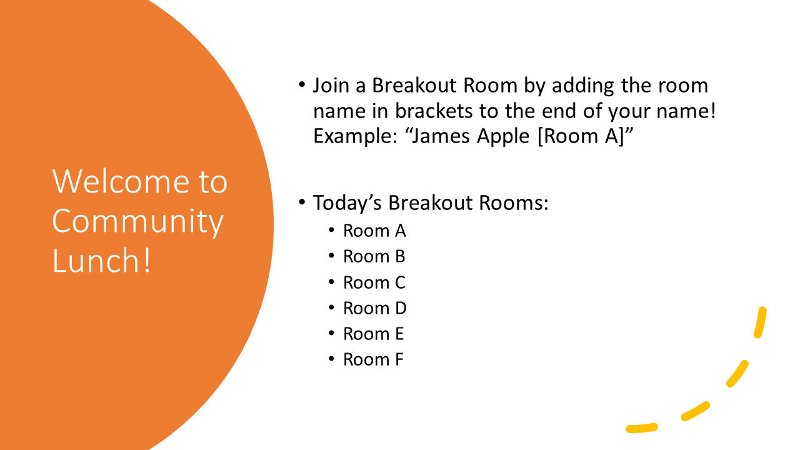

# Breakout Room Bot for Zoom Meetings Chrome Extension

*Making it possible for **everyone** to walk around to other Breakout Rooms in a Zoom Meeting without the aid of the Host*

Discord for help, comments, discussion, etc. : https://discord.gg/NS6nbrT

TODO: Video Showcase/Tutorial/Demo. Sample below; not final.

Example Screen Share in main meeting:

## Usage (As Host)

It is strongly recommend you do a dry run with some associates first!

1. Install the extension from the Chrome Web Store @ https://chrome.google.com/webstore/detail/breakout-room-bot-for-zoo/acfkhlojnkihdmgikmkilfjkapkemcnd?hl=en&authuser=0
    * Alternatively, clone or download a copy of this repository and look for instructions online for loading "unpacked extensions" into Chrome or any other Chromium browser. Load the `extension` folder.
2. Go to the Zoom Meeting as the Host in a "Join from Browser" Zoom Meetings Web Client.
    * Button to launch extension only works on `*.zoom.us` domains.
3. Ensure the Breakout Rooms are already open and have started.
4. Click the extension button in the menu bar to open the popup
    
5. Click the button to "Attach and Launch Breakout Room Bot"

After:

* Do not close the Breakout Rooms and Chat Window while the bot is in operation.
* Unless you like cacophony, do not join audio in this client. You can leave audio by clicking the "^" next to the microphone icon and selecting "Leave `<Something>` Audio".
* Use another Zoom client on the system to actually participate in the meeting. You can safely make this other client a Co-Host if it isn't already from the attached bot-controlled web client UI.

### Notes for Co-Hosts

* With plain Zoom, you cannot assign users to breakout rooms. You can move around freely between Breakout Rooms without the bot though. Co-Hosts can also rename users. This means you can also rename users to have the bot assign them to Breakout Rooms!

## Usage (As Attendee)

**Chat commands only work in the main or root Zoom meeting**.

If you're in a breakout room, you can return to the main or root Zoom meeting from a Breakout room by selecting End Meeting in a Breakout Room and selecting Leave Breakout room.

* `!ls` List Rooms
    * Alternatively, the Host can share screen a slide or image with a list of room names.
    * This also takes an argument to list users in a particular room name.
* Switching Rooms as a non-host or non-cohost (this is whole reason for this bot's existence)
    * Two methods
        * *`!mv <room id>`* or *`!mv <room name>`*
            * Move to breakout room ID or a room name that best matches. List of room IDs and names of Breakout Rooms can be found with `!ls`. The host may have also screen shared a screen with the list.
        * *Rename yourself and append/change a `[room id]` or `[room name]` to your name.*
            * Unlike chat commands, this action *also works inside Breakout rooms and not just the main meeting*!
            * For example, if your name is "Bryan", change your name to "`Bryan [1]`" to move to the room with the ID of "`1`".
            * Another example, if your name is "Bryan", change your name to "`Bryan [Foo]`" to move to the room whose name best matches "Foo".
    * Both the `!mv` command and the name change action can take a *room name*.
      The best matching room name is the room the requester will be sent to. **This is a fuzzy search.**

      Breakout rooms are by default named `Breakout Room <some number>` but they can be renamed before the breakout rooms are opened or while the rooms are temporaily closed.
        * Example
            * If you have Breakout Rooms with Room IDs and named:
                1. Breakout Room 1
                2. Tokyo
                3. Los Angeles
                4. Las Vegas
                5. City 17
                6. Bangkok
                7. Pilgrims
                8. Breakout Room 15
                9. HNH1 computation group
                10. Henderson Party
            * To switch to "Las Vegas", "Bryan" can chat "`!mv las`" or change their name to "`Bryan [las]`".
                * Alternatively, the room ID of "Las Vegas" is 4 and Bryan can also chat
                  `!mv 4` or change their name to `Bryan [4]`.
        * If you don't get the room you want, just be more specific or "correct".
* `!version` Have the bot print out the version.

# Limits on Scale

* You should run this on a fast computer!
* If you have performance problem with native Zoom clients, close the chat window.

## Developer

* Zip the extension folder and upload it to the Chrome Web Store.
* It's a hack, apologies for the cobbled-togetherness.

## License

MIT

## Credit

This is likely cobbled together from piles of stackoverflow, random Google Searches, and contributors.

This hack/bot uses [RxJS][rxjs] and [Fuzzysort][fuzzysort].

[breakoutroominfo]: https://support.zoom.us/hc/en-us/articles/206476093-Enabling-breakout-rooms
[ocrbreakoutroombot]: https://github.com/ottoscholten/zoomChatBot
[desertpyhack]: https://www.meetup.com/Phoenix-Python-Meetup-Group/events/272227324/
[desertpy]: https://www.meetup.com/Phoenix-Python-Meetup-Group
[rxjs]: https://rxjs-dev.firebaseapp.com/
[fuzzysort]: https://github.com/farzher/fuzzysort
[preassign]: https://support.zoom.us/hc/en-us/articles/360032752671-Pre-assigning-participants-to-breakout-rooms