# Hacky Zoom Breakout "Bot"

*Making it possible for **everyone** to walk around to other Breakout Rooms in a Zoom Meeting without the aid of the Host*

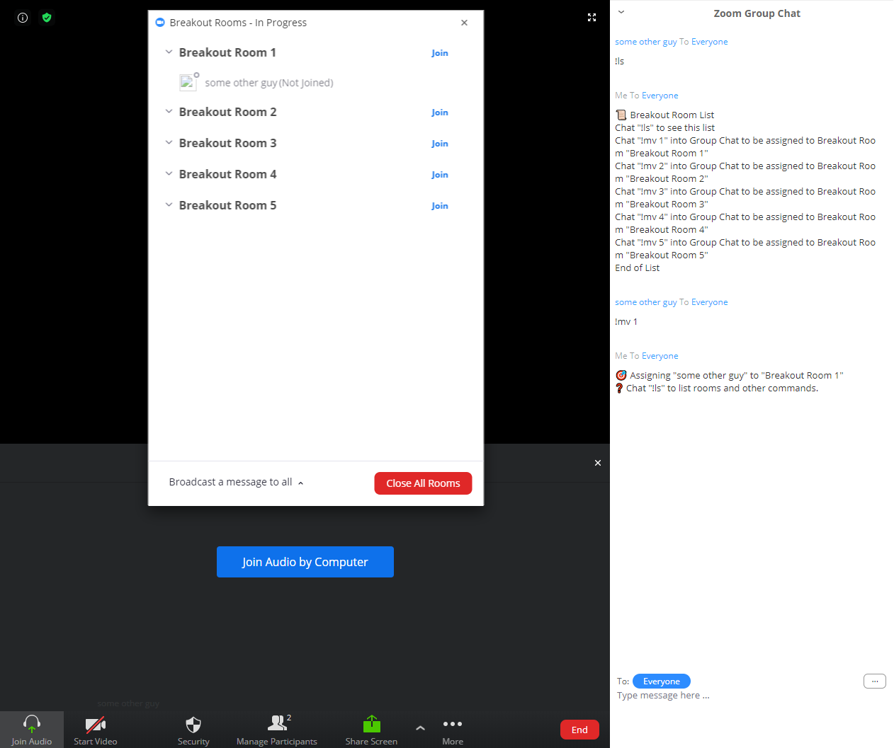

This is a Zoom Meetings Breakout Room bot/script.

[Breakout Rooms are a feature in Zoom Meetings that allow breaking up a large meeting into their own groups.][breakoutroominfo]

However, non-hosts cannot list breakout rooms or self-assign themselves to breakout rooms. This can be troublesome with [hackerthon meetings][desertpyhack] or micro-conventions where attendees who are not hosts or co-hosts would like to "walk" around to different breakout rooms and see what's up. The existing interface also requires the full attention of the Host(s) to the root meeting to assign attendees. For hosts using Zoom with many unregistered attendees, it can also be painful and tiresome to initially assign attendees.

The bot allows attendees to self-serve switching between breakout rooms functionality:

* List Breakout Rooms
* Self-Assign themselves to a Breakout Room.

The interface for attendees is the Group Chat feature. Attendees can chat `!ls` to get a list of rooms and corresponding `!mv` commands to be assigned to a room.

This bot is **quite** hacky and uses undocumented APIs/moxie! But it is almost unmatched out there except for [a bot trying to OCR a Mac client's screen and doing similar stuff][ocrbreakoutroombot]. Functionality is made possible by operating on the web client where the UI is relatively malleable and the internal state of client is somewhat accessible. By this nature, **the bot is very hacky and is expected to break someday.**

Let's start with the limitations and possible mitigations as they may be deal breakers:

* The Host must dedicate a web client to the meeting.
    * Mitigation: Open another window/client and make that window/client a **Co-Host**.
        * **UNTESTED AT THE MOMENT**: I need 15 dollars. 💸
    * Mitigation: If **Co-Host** functionality is not available, you can join and participate into the meeting as a non-Host attendee. Of course, you can switch Breakout Rooms with the help of this bot.
* A Chrome-based browser must be used. This bot was developed with and only tested on Google Chrome. It may work on similar browsers such as Chromium, Edge, or Opera.

There are also some oddities of note as well:

* The Breakout Room setup will require at least two users to be in the meeting and the Breakout Rooms to have been be created and started. This can be accomplished all by yourself, if needed.
* You will need to copy and paste huge pieces of Javascript. You can save them as snippets though for easy recall.

Hopefully, great demand for such a feature will manifest in an API or support to implement these features properly as some sort of extension. There may be a way to implement this by using the Zoom Native SDK but it appears to require special API Keys and reimplementing much of the client. It also might not be usable with "special" Zoom versions.

## Usage (As Host)

**TODO** VIDEO:

### Requirements

* You must have access to a Chrome-based browser on a Desktop or even Chromebook.
* Breakout Rooms must be enabled. Check the Zoom site or ask your Zoom administrator.
    * Breakout Room Setting:
        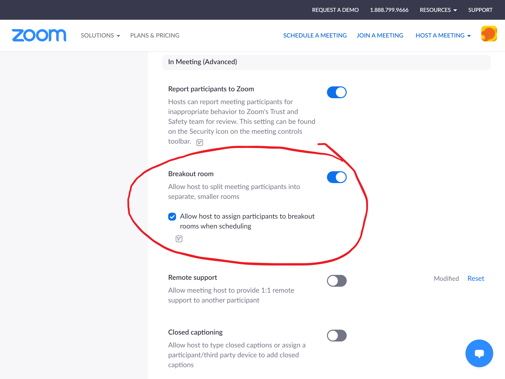
* **STRONGLY RECOMMENDED**: Enable the "Join from your web browser" link to always show up.
    * Enable Web Meeting Always Setting:
        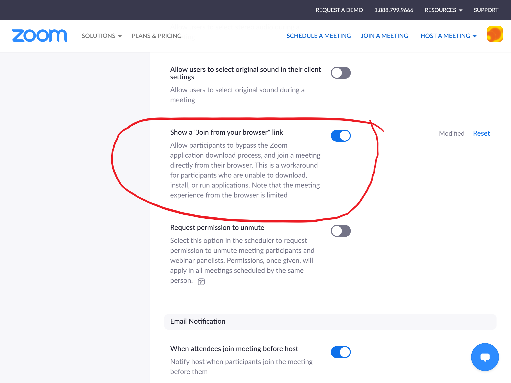
    * Alternatively, but annoyingly, you can also press the "Download and Run Zoom" link, ***not** run the EXE, or installer*, and then the "Join from your web browser" link will show:
        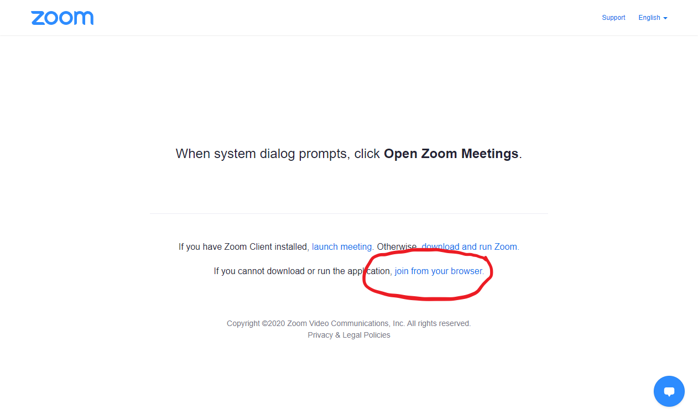

### Host Setup

1. Click on your meeting link as a host.
2. Click on the "Join from your web browser" link
    
    * **DO NOT JOIN WITH THE NATIVE CLIENT!**
    * If the link does not appear, click the "Download and Run Zoom" link, ***not** run the EXE, or installer*, and then the "Join from your web browser" link will which you can click:
    * This tab will be called the **HOST MEETING TAB**.
3. Have another attendee in the meeting.
    * You can join your own meeting again from another client or more simply just have another attendee present.
4. Click on Breakout Rooms and create your rooms.
5. Assign a user at least to a room to make sure the *Open All Rooms* button is enabled.
    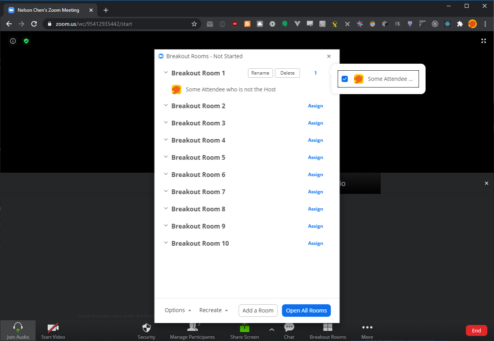
6. *Open All Rooms*
    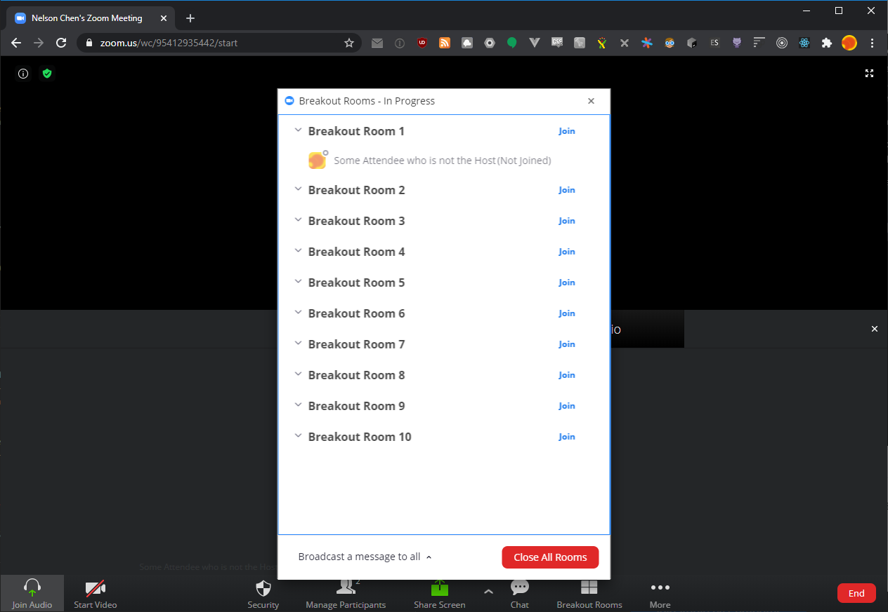
7. Right click anywhere empty-ish in the **HOST MEETING TAB** and choose *Inspect*.
    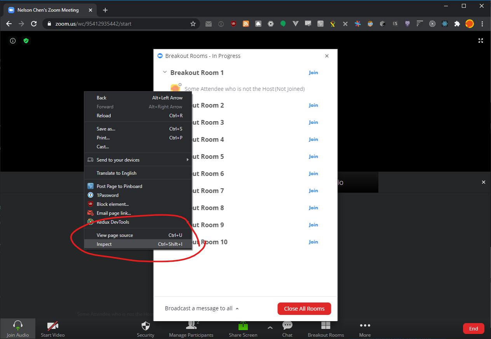
8. The Chrome Devtools will open. Choose the *Console* option and get to a Window similar to this. You should also see some logging in the console talking about video and stuff from Zoom.
    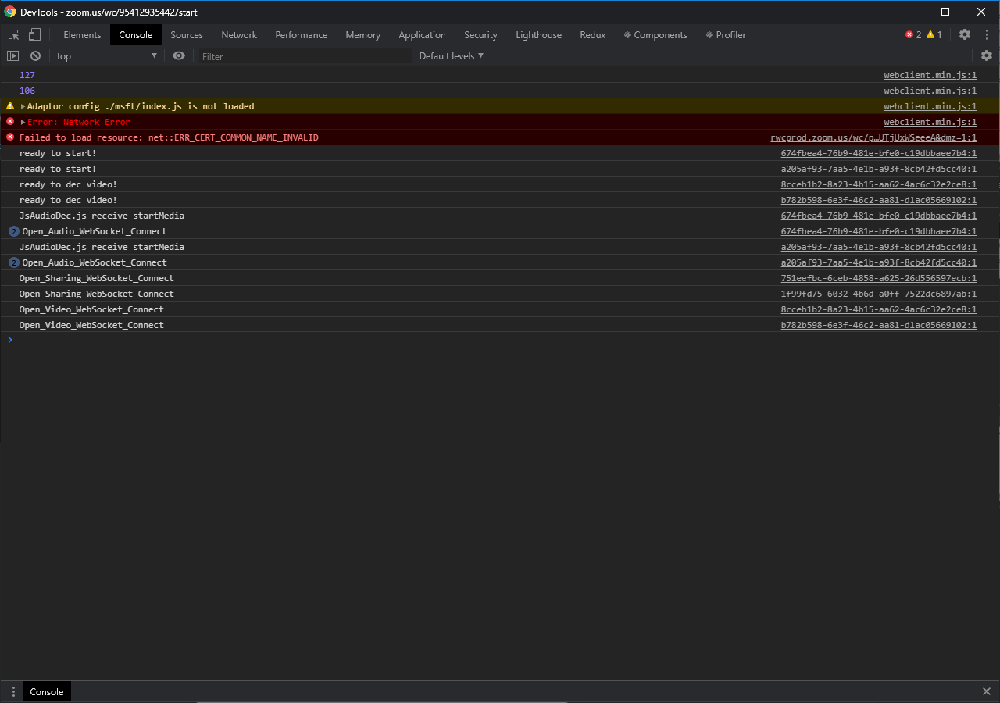
9. As a sanity check, run `console.log("hello")` and make sure you get "hello" as a reponse in the console. The window should look like this:
    * 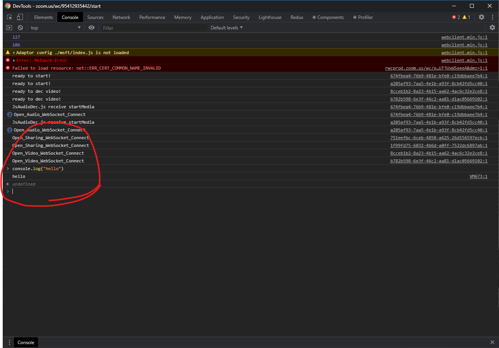
10. Copy the contents of this file to your clipboard. Press Ctrl-A or Cmd-A to select the whole file and then press Ctrl-C or Cmd-C to copy it.
    * https://unpkg.com/rxjs@6.6.2/bundles/rxjs.umd.min.js
    * Alternatively, you can copy the full-unminimized version:
        * https://unpkg.com/rxjs@6.6.2/bundles/rxjs.umd.js
11. Paste the clipboard or contents of the file into the Console where you ran `console.log("hello")` earlier and run it.
    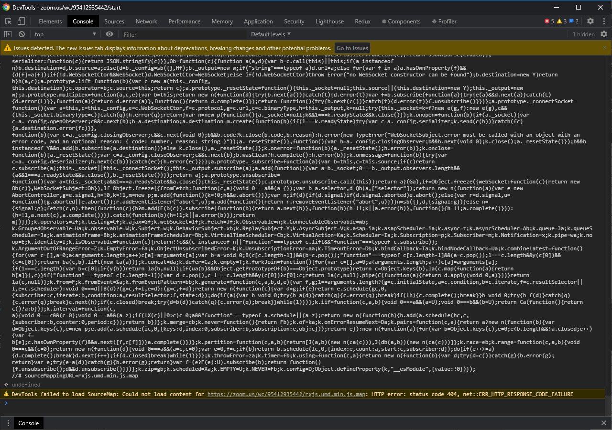
12. Copy the contents of the bot's source to your clipboard. Press Ctrl-A or Cmd-A to select the whole file and then press Ctrl-C or Cmd-C to copy it.
    * https://raw.githubusercontent.com/nelsonjchen/HackyZoomBreakoutBot/master/BreakoutRoomBot.js
13. Paste the clipboard or contents of the file into the Console where you ran `console.log("hello")` earlier and run it.
14. Have another attendee chat `!ls`. You should get a list.
15. Have another attendee chat some `!mv` option and ensure the attendee is moved.
    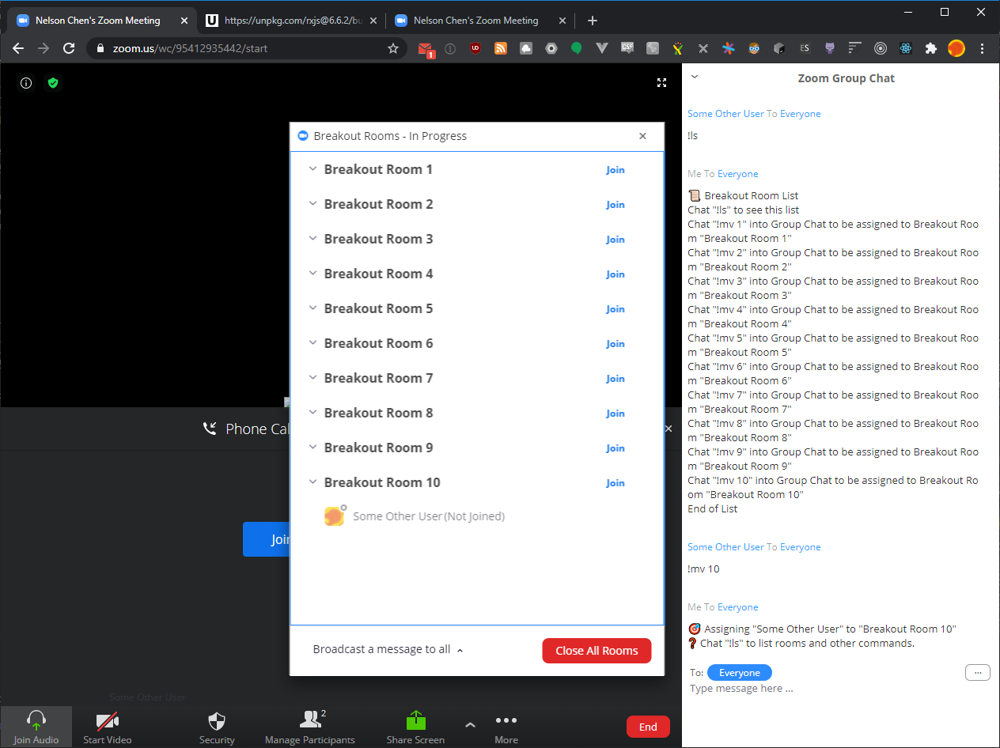
16. If all goes well, the attendee should be moved to a breakout room.
17. The Breakout Rooms Window and the Group Chat Window *must remain visible* for this bot to continue working. Do not close them or the bot cannot perform actions.

## Usage (As Attendee)

**These commands only work in the main or root Zoom meeting**. If you're in a breakout room, you can return to the main or root Zoom meeting from a Breakout room by selecting End Meeting in a Breakout Room and selecting Leave Breakout room.

* `!ls` List Rooms
* `!mv <room id>` Move to breakout room ID. List of IDs can be found with `!ls`.
* `!version` Have the bot print out the version.

## License

MIT

## Credit

This is likely cobbled together from piles of stackoverflow and random Google Searches.

[breakoutroominfo]: https://support.zoom.us/hc/en-us/articles/206476093-Enabling-breakout-rooms
[ocrbreakoutroombot]: https://github.com/ottoscholten/zoomChatBot
[desertpyhack]: https://www.meetup.com/Phoenix-Python-Meetup-Group/events/272227324/
[desertpy]: https://www.meetup.com/Phoenix-Python-Meetup-Group
