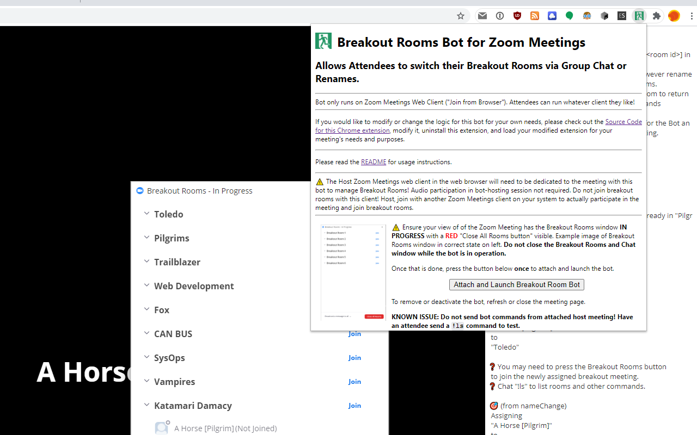

# Breakout Room Bot for Zoom Meetings Chrome Extension

*Making it possible for **everyone** to walk around to other Breakout Rooms in a Zoom Meeting without the aid of the Host*

Discord for help, comments, discussion, etc. : https://discord.gg/NS6nbrT

TODO: Video Showcase/Tutorial/Demo

## Usage (As Host)

1. Install the extension from the Chrome Web Store @ https://chrome.google.com/webstore/detail/breakout-room-bot-for-zoo/acfkhlojnkihdmgikmkilfjkapkemcnd?hl=en&authuser=0
    * Alternatively, clone or download a copy of this repository down and look for instructions online for loading "unpacked extensions" into Chrome or any other Chromium browser. Load the `extension` folder.
2. Go to the Zoom Meeting as the Host in a "Join from Browser" Zoom Meetings Web Client.
    * Button to launch extension only works on `*.zoom.us` domains.
3. Ensure the Breakout Rooms are already open
4. Click the extension button in the menu bar to open the popup
    
5. Click the button to "Attach and Launch Breakout Room Bot"

## Usage (As Attendee)

**Chat commands only work in the main or root Zoom meeting**.

If you're in a breakout room, you can return to the main or root Zoom meeting from a Breakout room by selecting End Meeting in a Breakout Room and selecting Leave Breakout room.

* `!ls` List Rooms
* Switching Rooms as a non-host or non-cohost (this is whole reason for this bot's existence)
    * Two methods
        * *`!mv <room id|room name query>`*
            * Move to breakout room ID or a room name that best matches the query. List of room IDs and names of Breakout Rooms can be found with `!ls`.
        * *Rename yourself and append/change a `[<room id|room name query>]` to your name.*
            * Unlike chat commands, this action *also works inside Breakout rooms and not just the main meeting*!
            * For example, if your name is "Bryan", change your name to "`Bryan [1]`" to move to the room with the ID "`1`".
            * For example, if your name is "Bryan", change your name to "`Bryan [Foo]`" to move to the room whose name best matches "Foo".
    * Both the `!mv` command and the name change action can take a *room name query*.
      The best matching room name of the query is the room the requester will be sent to. **This is a fuzzy search.**

      Breakout rooms are by default named `Breakout Room <some number>` but they can be renamed before the breakout rooms are opened or while the rooms are temporaily closed.
        * Example
            * If you have Breakout Rooms with Room IDs and named:
                1. Breakout Room 1
                2. Tokyo
                3. Los Angeles
                4. Las Vegas
                5. City 17
                6. Bangkok
                7. Pilgrims
                8. Breakout Room 15
                9. HNH1 computation group
                10. Henderson Party
            * To switch to "Las Vegas", "Bryan" can chat "`!mv las`" or change their name to "`Bryan [las]`".
                * Alternatively, the room ID of "Las Vegas" is 4 and Bryan can also chat
                  `!mv 4` or change their name to `Bryan [4]`.
        * If you don't get the room you want, just be more specific or "correct".
* `!version` Have the bot print out the version.

## Limitations on Scale

This is a hack, there may be some limits. This bot was written for meetings of about 30 or 40 people but may work for much larger.

One breakout room assignment can be performed every 300ms for reliability reasons. If you are able to pre-assign users to a correct breakout room with the [pre-assign users to breakout room functionality][preassign], I suggest you do so. If the assignment throttle is hit, assignments are queued and will eventually complete.

300ms was just a reasonable low value. They can be lowered by editing the source code around these location:

* The 300ms throttling queue for requests
    * https://github.com/nelsonjchen/BreakoutRoomsBotForZoomMeetings/blob/f760f5fbb83f082a8ea7743ac23808874ad9be72/extension/BreakoutRoomBot.js#L277

This is a definitely a *your mileage will vary* modification. If you do so, I suggest using a good (gaming!) PC and a wired connection to host the bot.

The meeting state is read from the internal store and is very reliable. However, controlling the meeting and performing actions is intentionally rate limited and throttled as it simulates clicks
and selections upon the meeting's HTML page and this is inherently rate-limited and possibly buggy.

## Developer

* Zip the extension folder and upload it to the Chrome Web Store.
* It's a hack, apologies for the cobbled-togetherness.

## License

MIT

## Credit

This is likely cobbled together from piles of stackoverflow, random Google Searches, and contributors.

This hack/bot uses [RxJS][rxjs] and [Fuzzysort][fuzzysort].

[breakoutroominfo]: https://support.zoom.us/hc/en-us/articles/206476093-Enabling-breakout-rooms
[ocrbreakoutroombot]: https://github.com/ottoscholten/zoomChatBot
[desertpyhack]: https://www.meetup.com/Phoenix-Python-Meetup-Group/events/272227324/
[desertpy]: https://www.meetup.com/Phoenix-Python-Meetup-Group
[rxjs]: https://rxjs-dev.firebaseapp.com/
[fuzzysort]: https://github.com/farzher/fuzzysort
[preassign]: https://support.zoom.us/hc/en-us/articles/360032752671-Pre-assigning-participants-to-breakout-rooms